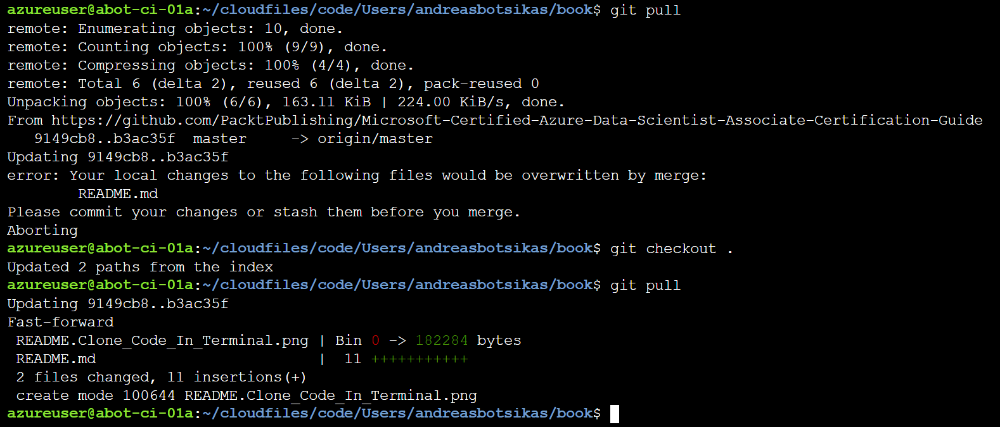

# Updates and additional topics

This file contains various updates to the book and additional help requested over github issues.

## Clone this repository within your Azure Machine Learning workspace

To clone the code in your workspace, open a terminal and use the following command:

``` bash
git clone https://github.com/PacktPublishing/Microsoft-Certified-Azure-Data-Scientist-Associate-Certification-Guide.git book
```

This command will clone this repository into the `book` folder. If you refresh the **Files** tree, you should be able to see the new folder.


To pull the latest version of the codebase, you will first need to revert any changes made to your working copy and then pull the new version. You can do that using the following code:

``` bash
git checkout .
git pull
```

The following image shows what will happen if you have changes in your working copy that conflict with the changes on the remote GitHub server. This image also shows how to revert all local changes and then pull the latest version from the remote GitHub server.


